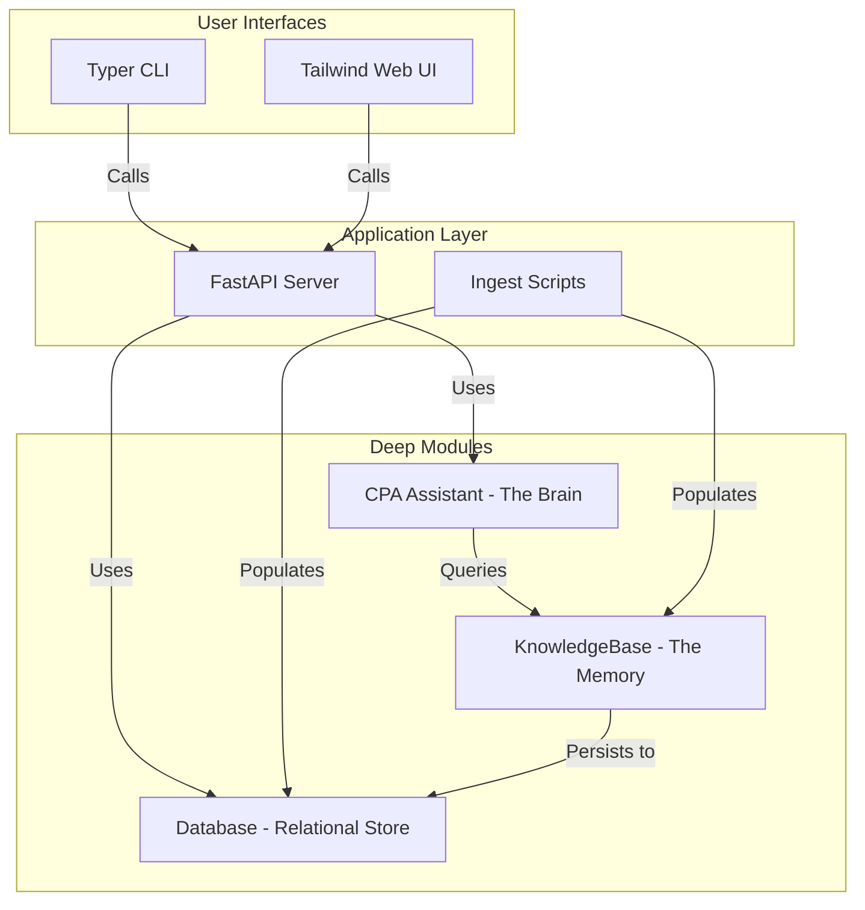

# Personal Local CPA

A completely local, privacy-first personal finance and tax management application.

## Overview
This application is designed for individuals who want the power of AI-driven financial advice without compromising their data privacy. It runs entirely on your local machine, using a local LLM and a local vector database.

## System Architecture
The project follows a **Deep Module** architecture, separating the "Brain" (LLM reasoning) from the "Memory" (Vector storage).



### Key Modules
- **`CPAAssistant`**: Encapsulates persona, prompt engineering, and LLM inference.
- **`KnowledgeBase`**: Manages the RAG lifecycle: text extraction, chunking, and semantic embedding.
- **`Database`**: Handles SQLite-VSS persistence for both transactions and vector memory.
- **`Ingest`**: Robust parsing and normalization of messy financial data.

## Features
- **Local Intelligence**: Uses `llama-cpp-python` to run GGUF models (like Phi-3) on your hardware.
- **Semantic Memory**: Grounded tax advice using RAG (Retrieval-Augmented Generation).
- **Multi-Spec**: Support for both CPU (laptop) and GPU (workstation) installations.
- **Evaluation Framework**: Built-in benchmarking suite to compare model speed and accuracy.

## Tech Stack
- **Backend**: Python 3.11+, FastAPI, `uv`
- **Intelligence**: `llama-cpp-python`, `fastembed` (BGE-small)
- **Database**: SQLite with `sqlite-vss` extension
- **Frontend**: Tailwind CSS + Vanilla JS

## Getting Started

### Prerequisites
- `uv` (Install with `curl -LsSf https://astral.sh/uv/install.sh | sh`)
- For GPU support: CUDA Toolkit.

### Setup
1. Clone the repository.
2. Install LLM dependencies:
   ```bash
   # For CPU (Laptop)
   ./install_llm.sh
   # For GPU (CUDA)
   ./install_llm.sh --gpu
   ```
3. Sync remaining dependencies:
   ```bash
   uv sync
   ```

### Running the Application
1. **Start the Backend**:
   ```bash
   uv run python -m uvicorn main:app --reload
   ```
2. **Use the CLI**:
   ```bash
   # Chat with your assistant
   uv run python cli.py chat
   # Benchmark a model
   uv run python cli.py eval models/your_model.gguf --rag
   ```

## Roadmap
- [x] Slice 1-4: Core infrastructure, LLM, and Chat.
- [x] Slice 5: Vector Memory & Embedding.
- [x] Slice 6: RAG-based Tax Guru.
- [x] Slice 7: Bank Statement Ingestion.
- [x] **Architectural Refactor**: Deep modules and Dependency Injection.
