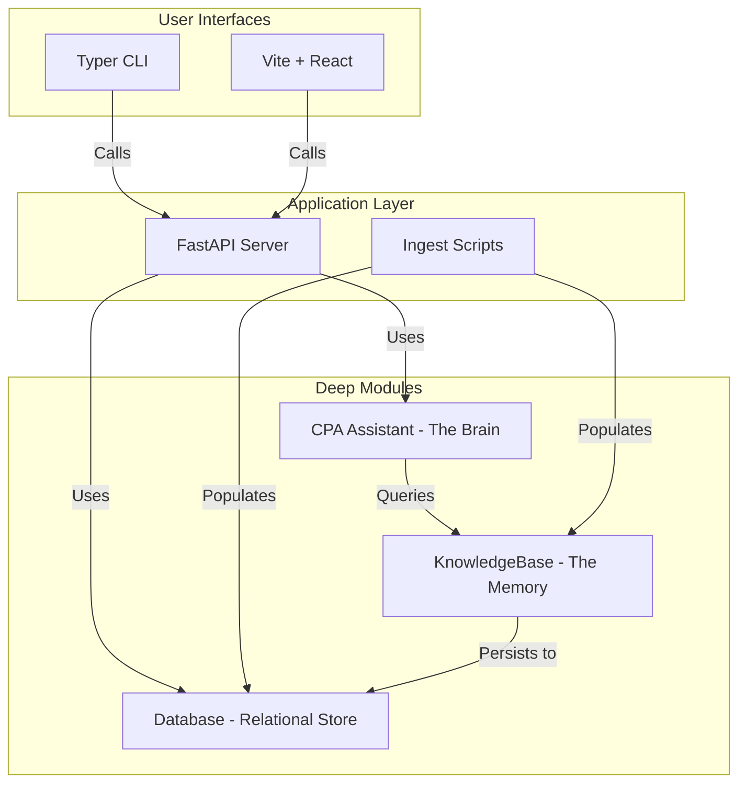

# Personal Local CPA

A completely local, privacy-first personal finance and tax management application.

## Overview
This application is designed for individuals who want the power of AI-driven financial advice without compromising their data privacy. It runs entirely on your local machine, using a local LLM and a local vector database. No data ever leaves your machine.

## Running Instructions (The "Painless" Way)

This application is optimized for **Ollama**, which provides the best GPU performance and easiest setup for local LLMs.

### 1. Install Ollama
Download and install Ollama from [ollama.com](https://ollama.com).

### 2. Download the Models
We recommend two tiers of models based on your hardware (optimized for 64GB RAM / 8GB VRAM):
```bash
# Llama 3.1 8B (High Speed & Good Intelligence)
ollama pull llama3.1:8b-instruct-q8_0

# Mistral Nemo 12B (Highest Intelligence for complex tax queries)
ollama pull mistral-nemo
```

### 3. Setup the Application
Ensure you have `uv` installed (`curl -LsSf https://astral.sh/uv/install.sh | sh`).
```bash
uv sync
```

### 4. Run the Backend
Choose your intelligence tier using the `CPA_MODEL_TYPE` environment variable:

**Painless Tier (Llama 3.1 8B - Fast & Accurate)**
```bash
export CPA_MODEL_TYPE=painless
uv run uvicorn main:app
```

**Intelligence Tier (Mistral Nemo 12B - Expert Reasoning)**
```bash
export CPA_MODEL_TYPE=intelligence
uv run uvicorn main:app
```

### 5. Start the Web UI
In a new terminal:
```bash
cd frontend
npm install
npm run dev
```
Open your browser to `http://localhost:5173`.

### 6. Use the CLI
You can also interact with the system via the command line:
```bash
# Check current configuration
uv run python cli.py config

# Start an interactive chat
uv run python cli.py chat
```

---

## Technical Architecture

The project follows a **Deep Module** architecture, separating the "Brain" (LLM reasoning) from the "Memory" (Vector storage).



### Tech Stack
- **Backend**: Python 3.11+, FastAPI, `uv`
- **Intelligence**: **Ollama** (Llama 3.1, Mistral Nemo), `fastembed` (BGE-small)
- **Database**: SQLite with `sqlite-vss` extension
- **Frontend**: Vite, React, Tailwind CSS

## Roadmap
- [x] Core infrastructure & Multi-Model Provider support.
- [x] Vector Memory & Embedding (BGE-Small).
- [x] RAG-based Tax Guru.
- [x] Bank Statement Ingestion.
- [x] **Architectural Refactor**: Deep modules and Dependency Injection.
- [ ] Multi-user / Session support.
- [ ] Automated tax form pre-filling.
